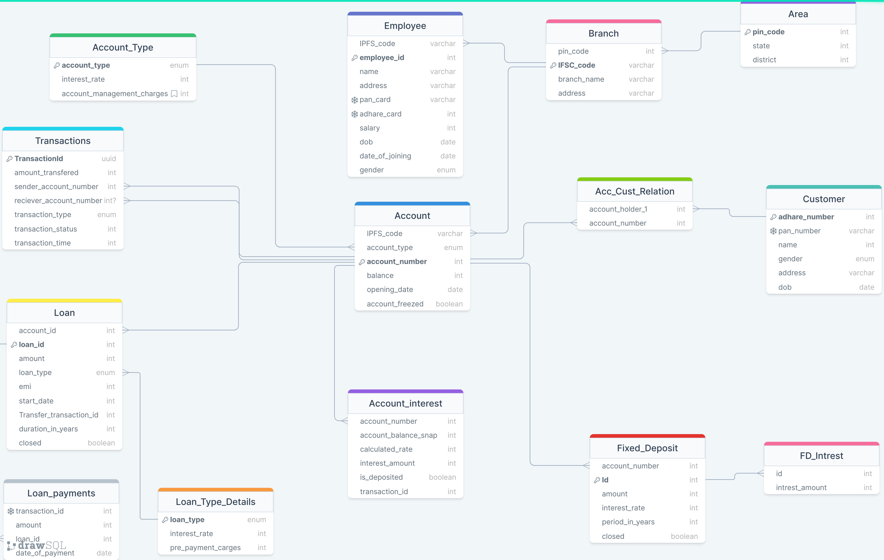
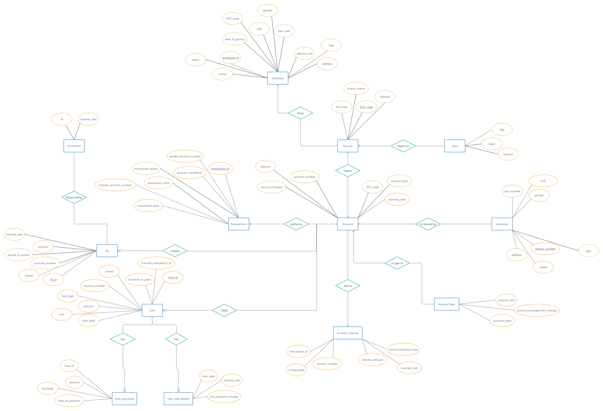

# Bank Database Management System
This is the bank database management system.

The aim of this project is to create a complete system that represents the banking database with the CRUD operations performed in the database with the schema design developed from scratch.

This is a learning project should be used into development/production environment at your **own risk** 

## RoadMap:

- [x] [Define rules](#rules).
- [x] [Create rough schema banking system](#schema-design).
- [x] [Create ER diagram](#er-diagram)
- [x] [Create Tables and define relations](./Schema/tables.sql)
- [x] [Set up db](#set-up-db)
- [x] [Create pre defined data](#pre-defined-data)
- [ ] Create function.
- [ ] Create Triggers.
- [ ] Enter dummy data.
- [ ] Create views.
- [ ] Write queries.

## Requirement  
1. Operating System: [Ubuntu](https://ubuntu.com/)
2. Database: [postgreSql](https://www.postgresql.org/docs/current/app-psql.html)
3. Tool: [PgAdmin](https://www.pgadmin.org/), [drawsql.app](https://drawsql.app/)

## Rules 

1. This is the complete schema design for a single bank which includes banks in multiple areas.
2. Two type of account are supported in this version
    1. Saving account
        - Saving account has a minimum balance limit of Rs.1000, Account with balance lower than this Rs.25 will be deducted monthly.
        - Interest rate of 3% is provided on the balance of saving account which is calculated monthly. 
    2. Current account
        - Current account has a minimum balance limit of Rs.5000, Account with balance lower than this Rs.25 will be deducted monthly.
        - Non-maintenance fee Rs.1500 will be charged quarterly for current account.
        - Further restrictions will be imposed on withdrawal of money from atm etc.
3. Loan will also be provided to a individual based on his/her monthly income. Two type of loan are supported into the application.
    1. Fixed rate loan
        - 3% pre loan payment charges.
        - 10% interest rate will be applicable on the loan.  
    2. Floating rate loan
        - No pre loan payment charges will be applied.
        - Interest rate will be calculated based on the market situations.
4. A customer can create a FD.
    1. 6% of interest rate will be provided on an FD.
    2. In case of early cancellation of FD interest of last month would be deducted.
5. Every branch will have it's own account with initial balance of 1cr, This balance will be used to give loans, Also when a FD is created FD amount will be deposited to this account.
    
## Schema Design
- DesignLink:- [Link](https://drawsql.app/teams/badrik-team/diagrams/banking)


## ER Diagram
- Diagram Link:- [Link](https://app.creately.com/d/ZfTP84sSsvS/view)


## Set up DB
- For the simplicity purpose lets create a database **bank** with one user **bank owner**. We can also implement access control/role base access into the database.

    ```sh
    ##Create Role
    CREATE ROLE bankowner WITH LOGIN PASSWORD 'root';

    ##Create Database
    CREATE DATABASE bank WITH OWNER = bankowner;

    ##By default anyone can connect the database bank so revoke all permissions from public.    
    REVOKE ALL ON DATABASE bank FROM PUBLIC;

    ##Login on database bank with bankOwner
    psql -U bankowner -d bank;
    ```
## Pre Defined Data
1. Area table should contain all list of area with the required information.
2. Bank needs to be pre-defined.
3. Every bank has it's own account with balance of 1cr.
4. Sql file with pre-defined data. [link](./Query/preDefinedData.sql)


## Create function List

1. Account
    1. [ ] Create customer
    2. [ ] Create account
    3. [ ] Create joint account
2. Transaction
    1. [ ] Perform transaction
    2. [ ] Print pass book  