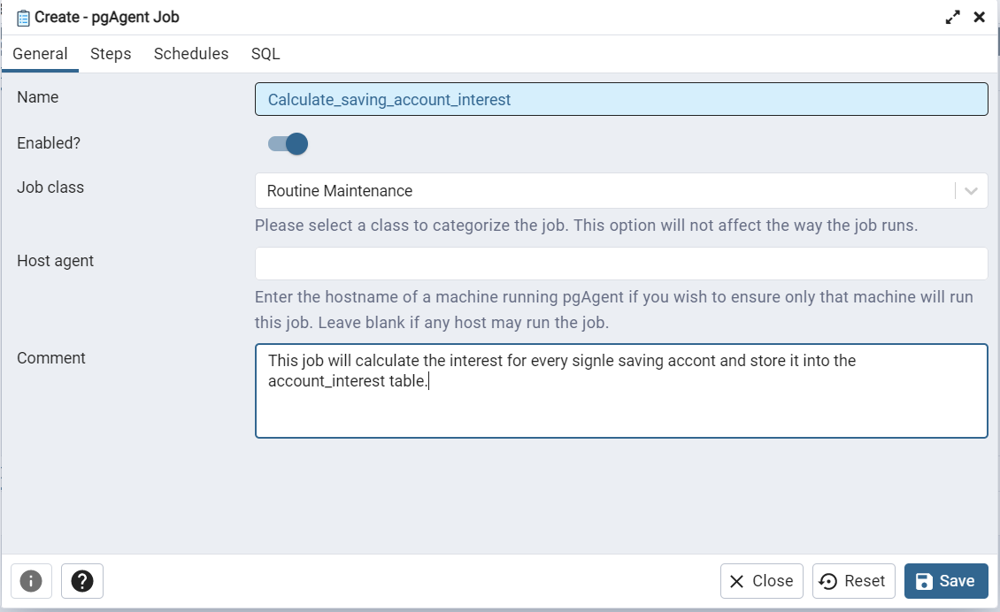

# Time Based Jobs

Time based jobs in postgresql database are done using [pgAgent](https://www.pgadmin.org/docs/pgadmin4/development/pgagent.html).


Lots of functionalities required a timely execution for the maintainable of the state of the database. For example a function that calculates saving account interest needs to run regularly at the end of every day to calculate the interest of the account closing balance.

## How to Install pgAgent? 
- This install is for ubuntu users.
```sh
sudo apt update
sudo apt -y install pgagent
```

- You also need to install [pgAdmin](https://www.pgadmin.org/) to work efficiently with pgAgent.

- You can create a Scheduled job using pgAdmin and PgAgent that keeps on triggering in a scheduled interval of time.

## Let's schedule a job

- Create a function to calculate saving account interest. [refer](./../Functions/accounts/saving_interest_time.sql)

- Create a pgAgent extension into the the required database by using query.
```sh
    CREATE EXTENSION pgagent;
```
on the success full execution you will see pgAgent Jobs option into pgAdmin tree.</br>


# Create a Job in pgAgent as shown below step wise.

step 1<br/>
<br/>

step 2<br/>
1. 2.1<br/>
<br/>

2. 2.2<br/>
<br/>

step 3<br/>
<br/>

step 4<br/>
<br/>


